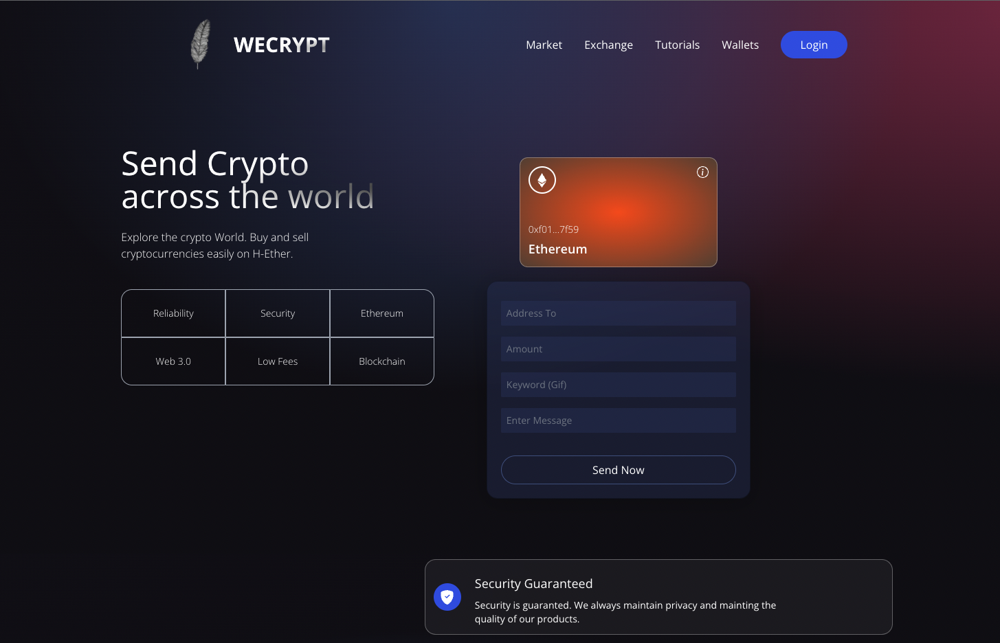

# WeCrypt - Web 3.0 Blockchain Application



Web 3.0 has the potential to change the internet as we know it, forever. You're still early in catching the trend right now and building your first blockchain cryptocurrency app. 

With a stunning design, connected to the blockchain, metamask pairing, interaction with smart contracts, sending Ethereum through the blockchain network, writing solidity code, and much more, WeCrypt is just a basic #Web3 #Blockchain app that you can develop to learn more about the web3 tech.

## ⚠️ WARNING ⚠️
This is a test app and only supports ETH testnet (ropsten). Please don't transafer any real funds as it will be lost and the person who has done it will be responsible for that.

## 🧑🏼‍💻 Technologies used
- Web 3.0
- ReactJS
- Context API
- Solidity
- Vite
- Metamask
- Tailwind CSS
- Ethers
- Hardhat
- Giphy API
- [Alchemy](https://www.alchemy.com/)


## 🚰 ETH Ropstem Faucets
- [🚰 1](https://faucet.egorfine.com)
- [🚰 2](https://faucet.dimensions.network)

## ⬇️ Installation

```sh
# clone repository
git clone https://github.com/Harsh-Tuwar/wecrypt.git

# cd into client and install dependencies
cd client && npm install

# go to /smart_contact and install dependencies
cd ../smart_contact && npm install
```

Create an .env file under `client`, Get an API key from the [Giphy developer](https://developers.giphy.com/) and add it to the .env file

```env
VITE_GIPHY_API=YOUR_API_KEY
```

and you are all set.

```sh
npm run dev:client
```
Start local dev server and head to [http://localhost:3000](http://localhost:3000).
